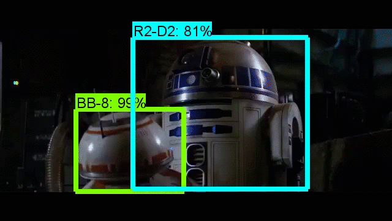

# Star Wars Object Detection
This repository contains the dataset and some of the configuration files to train an object detector of R2-D2 and BB-8 from Star Wars, 
using [Tensorflow's object detection API](https://github.com/tensorflow/models/tree/master/research/object_detection).

The final model has been fine-tuned using one of the [models pre-trained](https://github.com/tensorflow/models/blob/master/research/object_detection/g3doc/detection_model_zoo.md)
on the [COCO dataset](http://mscoco.org/) as a starting point (*transfer learning*).

## Some results

  

  

<a href="https://youtu.be/tIYGObVra6E" target="_blank">Here there's a video to show the performance of the model.</a>

The outcome seems acceptable considering the small size and low variability of the dataset used.

## Trying the dataset
In order to try the dataset, you first need to follow the [installation instructions](https://github.com/tensorflow/models/blob/master/research/object_detection/g3doc/installation.md) on the Tensorflow page. 
Then, you can train your own model following analogous commands as the ones used in the [pet detector](https://github.com/tensorflow/models/blob/master/research/object_detection/g3doc/running_pets.md).

### File description
#### Folders
* *annotations*: *xml* files with the boundig boxes of each image, obtained using [labelImg](https://github.com/tzutalin/labelImg), and a text file assigning each image to one of the two available classes (R2-D2 and BB-8). Analogous format as the one of the [Oxford-IIIT Pets Dataset](http://www.robots.ox.ac.uk/~vgg/data/pets/).
* *graph_images*: plots of the Total Loss of the trained model.
* *images*: 203 jpg train images, 102 of R2-D2 and 101 of BB-8.
* *object_detection/data*: configuration file of the net trained, label map and tensorflow records (created with [create_sw_tf_record.py](create_sw_tf_record.py)).
* *results*: some images/gifs showing the performance of the trained model.
* *test_images*: some images not used to train the model.

#### Scripts
* *check_duplicate_images.py*: script that allows you to check if there are duplicate images in one or two directories. Useful when collecting the train and test images.
* *create_sw_tf_record.py*: modified version of [create_pet_tf_record.py](https://github.com/tensorflow/models/blob/master/research/object_detection/create_pet_tf_record.py), where the paths have been changed along with the regular expression in *line 60* to adapt to my images names.
* *export_inference_graph.py*: an exact copy of [export_inference_graph.py](https://github.com/tensorflow/models/blob/master/research/object_detection/export_inference_graph.py) in Tensorflow's API.
* *object_detection_sw.ipynb*: ipython notebook to test the trained model on images and videos. Modified from [object_detection_tutorial.ipynb](https://github.com/tensorflow/models/blob/master/research/object_detection/object_detection_tutorial.ipynb) and some lines of code to test videos from [priya-dwivedi github](https://github.com/priya-dwivedi/Deep-Learning/blob/master/Object_Detection_Tensorflow_API.ipynb) (I don't know if that's the original source).
* *rename_images.py*: script to rename all images files in one directory to have the same root name.
